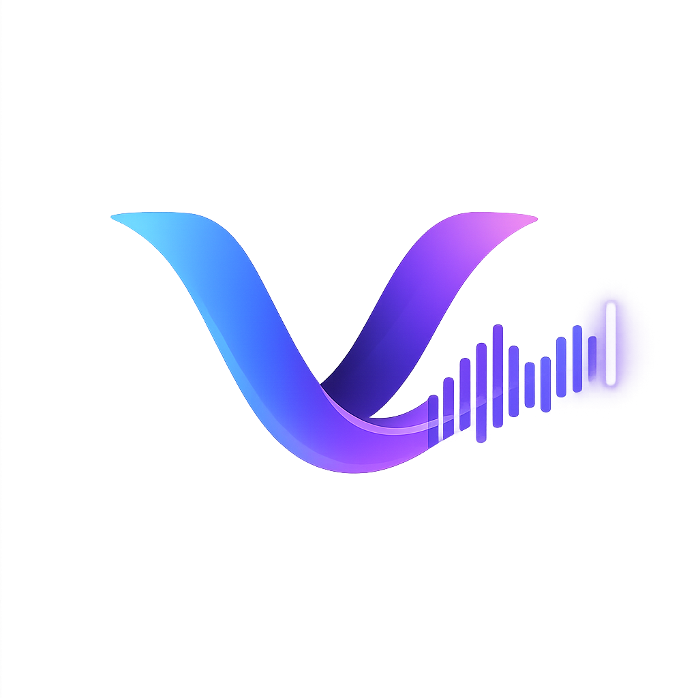

<div align="center">
  

  # Verbatim

  **Push-to-talk speech-to-text for Linux & macOS.**
  Hold a hotkey, speak, release — your words appear in the focused window.

  [](#license)
  [](#)
  [](https://tauri.app)
</div>

---

## Table of Contents

- [Features](#features)
- [Quick Start](#quick-start)
- [Requirements](#requirements)
- [Building](#building)
- [Installation](#installation)
- [Usage](#usage)
- [Configuration](#configuration)
- [GPU Acceleration](#gpu-acceleration)
- [Post-Processing with Ollama](#post-processing-with-ollama)
- [Releasing](#releasing)
- [Project Structure](#project-structure)
- [License](#license)

<details>
<summary><strong>How transcription & post-processing work</strong></summary>

Verbatim supports local STT via [whisper.cpp](https://github.com/ggerganov/whisper.cpp) — the only in-process inference engine, GPU-accelerated via CUDA / Vulkan / Metal with automatic CPU fallback — and cloud APIs (OpenAI Whisper).

Optional LLM post-processing (formatting, punctuation, emoji) is delegated entirely to an out-of-process [Ollama](https://ollama.com) daemon — managed, system-installed, or remote. Verbatim itself does **not** link or ship `llama.cpp`.

</details>

## Features

- 🎙️ Push-to-talk global hotkey (configurable)
- 🔒 Local STT with whisper.cpp — no internet required
- ☁️ Cloud STT via OpenAI Whisper API
- ⌨️ Types transcription into the focused window
- 📋 Clipboard integration (with clipboard-only mode)
- 🖥️ GUI for settings, history, and model management
- 🔍 SQLite-backed history with search and word-count stats
- ⬇️ Automatic model download from HuggingFace
- ⚙️ TOML config with environment-variable overrides
- 🚀 GPU acceleration for whisper.cpp (CUDA / Vulkan / Metal) with CPU fallback
- ✨ Local LLM post-processing via out-of-process Ollama

## Quick Start

```bash
git clone https://github.com/yourname/verbatim-linux.git
cd verbatim-linux
cd ui && npm install && cd ..
cargo tauri dev
```

On first launch, open **API Keys & Models**, download the `base.en` whisper model, then hold **Right Ctrl** to record.

## Requirements

### Build Dependencies

**Linux (Debian/Ubuntu):**

```bash
sudo apt-get install -y \
  build-essential cmake clang pkg-config \
  libasound2-dev libxdo-dev libssl-dev \
  libwebkit2gtk-4.1-dev libjavascriptcoregtk-4.1-dev libsoup-3.0-dev
```

GPU feature flags affect **whisper.cpp (STT) only**. LLM post-processing always runs out-of-process in Ollama.

| Build type | Command | Extra packages |
|---|---|---|
| CPU (default) | `cargo tauri build` | *(none)* |
| CUDA (NVIDIA) | `cargo tauri build --features cuda` | `nvidia-cuda-toolkit` |
| Vulkan (NVIDIA + AMD) — *untested* | `cargo tauri build --features vulkan` | `libvulkan-dev glslc` |
| ROCm (AMD) — *untested* | `cargo tauri build --features rocm` | `rocm-dev hipblas-dev` |

Optional (for PipeWire audio backend):
```bash
sudo apt-get install -y libpipewire-0.3-dev
```

**macOS:**

```bash
xcode-select --install
brew install cmake
```

**Rust toolchain** (1.75+):

```bash
curl --proto '=https' --tlsv1.2 -sSf https://sh.rustup.rs | sh
```

**Tauri CLI:**

```bash
cargo install tauri-cli
```

**Node.js** (18+):

```bash
cd ui && npm install
```

### Runtime Requirements

**Linux:**

- The user must be in the `input` group for the global hotkey to work:
  ```bash
  sudo usermod -aG input $USER
  ```
  Log out and back in after running this.

- A working audio input device (PulseAudio or PipeWire).

- **GPU drivers** depend on how the app was built:

  | Build type | Runtime dependencies | Notes |
  |---|---|---|
  | CPU (default) | *(none beyond base libs)* | — |
  | CUDA (NVIDIA) | NVIDIA drivers (`nvidia-driver-*`) | CUDA toolkit **not** needed at runtime (statically linked) |
  | Vulkan — *untested* | `libvulkan1` + GPU drivers | NVIDIA: `nvidia-driver-*`; AMD: `mesa-vulkan-drivers` |
  | ROCm (AMD) — *untested* | ROCm runtime + AMD drivers | `rocm-libs` or equivalent |

  No GPU? Whisper falls back to CPU automatically.

**macOS:**

- Accessibility permissions for keyboard simulation (System Settings → Privacy & Security → Accessibility).
- Microphone permissions.

## Building

### Development

```bash
cargo tauri dev
```

Starts the Vite dev server with hot reload for the React UI and launches the Tauri app pointing to it.

### Release Build

```bash
cargo tauri build
```

The binary is at `src-tauri/target/release/verbatim`. Bundled `.deb` and `.appimage` packages are in `src-tauri/target/release/bundle/`.

### Verbose Builds

GPU builds (CUDA, Vulkan) can take a while with no visible output:

```bash
cargo tauri build -v                # Tauri verbose
cargo tauri build -v -- -vv         # Tauri + Cargo verbose
cargo build --release -vv           # Cargo only, max verbosity (no bundling)
```

### Build Core Library Only

```bash
cargo build -p verbatim-core
```

### Run Tests

```bash
cargo test                                # full workspace
cargo test -p verbatim-core               # core library only
cargo test -p verbatim-core -- <name>     # single test by name
```

## Installation

### Homebrew (macOS & Linux)

```bash
brew tap mkamran67/verbatim
brew install verbatim                  # macOS (Metal) or Linux CPU
brew install verbatim --with-cuda      # Linux NVIDIA (CUDA)
brew install verbatim --with-vulkan    # Linux NVIDIA + AMD (Vulkan)
```

To switch GPU variant later:
```bash
brew reinstall verbatim --with-cuda
```

### Install a Local Build (Linux)

After running `cargo tauri build`, install the resulting bundle directly.

**Debian / Ubuntu (`.deb`):**

```bash
cargo tauri build
sudo dpkg -i src-tauri/target/release/bundle/deb/verbatim_*_amd64.deb
sudo apt-get install -f                # resolve any missing runtime deps
```

If `apt` reports unmet dependencies, install the typical runtime libs:

```bash
sudo apt-get install -y \
  libwebkit2gtk-4.1-0 libjavascriptcoregtk-4.1-0 \
  libsoup-3.0-0 libgtk-3-0 libayatana-appindicator3-1
```

**AppImage (distro-agnostic):**

```bash
chmod +x src-tauri/target/release/bundle/appimage/verbatim_*_amd64.AppImage
./src-tauri/target/release/bundle/appimage/verbatim_*_amd64.AppImage
```

**Bare binary (no bundle):**

```bash
sudo install -Dm755 src-tauri/target/release/verbatim /usr/local/bin/verbatim
```

After installing, ensure your user is in the `input` group (see [Runtime Requirements](#runtime-requirements)) and launch with `verbatim` or from your application menu.

**Uninstall:**

```bash
sudo apt-get remove verbatim           # if installed via .deb
sudo rm /usr/local/bin/verbatim        # if installed as bare binary
```

## Usage

### First Run

1. Launch the app — a default config is created automatically.
2. Go to **API Keys & Models** and download a whisper model (e.g. `base.en`).
3. Hold **Right Ctrl** (default hotkey) to record, release to transcribe.

### Available Hotkeys

```
KEY_RIGHTCTRL, KEY_LEFTCTRL, KEY_RIGHTALT, KEY_LEFTALT,
KEY_RIGHTSHIFT, KEY_LEFTSHIFT, KEY_F1-KEY_F12,
KEY_CAPSLOCK, KEY_SCROLLLOCK, KEY_PAUSE, KEY_INSERT
```

### Whisper Models

| Model | Size | Speed | Quality |
|---|---|---|---|
| tiny / tiny.en | ~75 MB | Fastest | Lower |
| base / base.en | ~142 MB | Fast | Good |
| small / small.en | ~466 MB | Moderate | Better |
| medium / medium.en | ~1.5 GB | Slow | High |
| large-v3 | ~2.9 GB | Slowest | Highest |

`.en` variants are English-only and faster/more accurate for English.

### Logging

Control log verbosity with `RUST_LOG`:

```bash
RUST_LOG=debug verbatim          # verbose
RUST_LOG=warn verbatim           # quiet
RUST_LOG=verbatim=debug verbatim # debug only for verbatim code
```

## Configuration

Config file location: `~/.config/verbatim/config.toml`

```toml
[general]
backend = "whisper-local"    # "whisper-local" or "openai"
language = "en"
clipboard_only = false       # true = clipboard only, don't type
hotkeys = ["KEY_RIGHTCTRL"]

[whisper]
model = "base.en"
model_dir = "~/.local/share/verbatim/models"
threads = 0                  # 0 = auto-detect

[openai]
api_key = ""                 # or set OPENAI_API_KEY env var

[deepgram]
api_key = ""                 # or set DEEPGRAM_API_KEY env var

[google]
credentials_path = ""        # or set GOOGLE_APPLICATION_CREDENTIALS env var

[audio]
device = ""                  # empty = default input device

[input]
method = "auto"              # "auto" or "enigo"

[post_processing]
enabled = false
provider = "openai"          # "openai" or "ollama"
model = "gpt-4o-mini"        # OpenAI chat model
# Ollama settings (used when provider = "ollama"):
ollama_mode = "managed"      # "managed" | "existing" | "custom"
ollama_url = "http://localhost:11434"   # used in "existing" / "custom" modes
ollama_auth_token = ""       # optional bearer token for "custom" mode
ollama_bundled_port = 11434  # port for the Verbatim-managed daemon
ollama_model = "llama3.2:1b"
```

Settings can also be changed in the GUI via the Settings and API Keys pages.

### Environment Variables

API keys can be set via environment variables instead of the config file:

```bash
export OPENAI_API_KEY="sk-..."
export DEEPGRAM_API_KEY="dg-..."
export GOOGLE_APPLICATION_CREDENTIALS="/path/to/credentials.json"
```

## GPU Acceleration

GPU backends accelerate **whisper.cpp (STT)** only — they are mutually exclusive feature flags. LLM post-processing runs in a separate Ollama process and is unaffected by these flags. The default build is CPU-only.

| Platform | Backend | Flag | GPUs Supported | Status |
|----------|---------|------|----------------|--------|
| Linux | CPU *(default)* | *(none)* | — | Supported |
| Linux | CUDA | `--features cuda` | NVIDIA | Supported |
| Linux | Vulkan | `--features vulkan` | NVIDIA + AMD | **Untested** |
| Linux | ROCm | `--features rocm` | AMD | **Untested** |
| macOS | Metal *(automatic)* | *(none)* | Apple Silicon / Intel | Supported |

You can check GPU status in **Settings → Debug → GPU Status**.

Whisper auto-detects CUDA at runtime: if `libcuda.so.1` loads and a device is visible, STT runs on GPU; otherwise it silently falls back to CPU. No separate CPU-only build is needed.

**Building with CUDA (NVIDIA):**

```bash
sudo apt install nvidia-cuda-toolkit
cargo tauri dev --features cuda       # Development
cargo tauri build --features cuda     # Release
```

**Building with Vulkan (NVIDIA + AMD) — untested:**

```bash
sudo apt install libvulkan-dev glslc
cargo tauri dev --features vulkan
cargo tauri build --features vulkan
```

**Building with ROCm (AMD) — untested:**

```bash
cargo tauri build --features rocm     # Requires ROCm/HIP SDK
```

## Post-Processing with Ollama

LLM post-processing has two providers: **`openai`** (cloud) and **`ollama`** (local). There is no in-process LLM — Verbatim does not embed `llama.cpp` or any other inference engine for post-processing. All local LLM work goes through Ollama over HTTP. Configs that previously used `provider = "local"` are auto-migrated to `provider = "ollama"` with `ollama_mode = "managed"` on first launch.

When `post_processing.provider = "ollama"`, Verbatim talks to an Ollama daemon over HTTP. Three connection modes are available:

| `ollama_mode` | What Verbatim does | When to use |
|---|---|---|
| `managed` | Downloads a pinned Ollama release into `~/.local/share/verbatim/ollama/`, spawns `ollama serve` on `127.0.0.1:{ollama_bundled_port}` and terminates it on exit. | You don't already have Ollama installed. |
| `existing` | Probes `http://localhost:11434/api/version` and talks to whatever's running. | You installed Ollama yourself (`curl -fsSL https://ollama.com/install.sh \| sh`). |
| `custom`  | Connects to `ollama_url`, optionally with `ollama_auth_token` as a bearer. | LAN / Tailscale / SSH tunnel / reverse-proxied domain. |

On first run, Verbatim probes port 11434: if something answers, the default becomes `existing`; otherwise `managed`. Pull models from the Post-Processing settings page (preset list includes `qwen2.5:1.5b`, `llama3.2:1b`, `gemma3:1b`, `smollm2:1.7b`), or with `ollama pull` on the command line.

**CUDA vs Vulkan on NVIDIA hardware:** both accelerate **whisper.cpp (STT)**; Vulkan support is currently untested in this project. LLM post-processing is out-of-process via Ollama, so its GPU usage depends on how Ollama itself is configured — not on how Verbatim is built. Ollama uses the GPU by default when a supported driver is present.

## Releasing

See [RELEASING.md](RELEASING.md) for the full multi-platform release pipeline (CI, Homebrew tap, automated SHA bumping). The steps below cover **creating a Linux release** end-to-end.

### 1. Bump the version

Update the version in **both** files — they must match:

- `src-tauri/Cargo.toml` → `version = "X.Y.Z"`
- `src-tauri/tauri.conf.json` → `"version": "X.Y.Z"`

```bash
git add src-tauri/Cargo.toml src-tauri/tauri.conf.json
git commit -m "Bump version to X.Y.Z"
```

### 2. Build the Linux release artifacts

Build each GPU variant you intend to ship. Each build overwrites the bundle directory, so move/rename artifacts between runs.

```bash
# CPU (default)
cargo tauri build
mv src-tauri/target/release/bundle/deb/verbatim_X.Y.Z_amd64.deb \
   dist/verbatim_X.Y.Z_amd64-cpu.deb

# CUDA (NVIDIA)
cargo tauri build --features cuda
mv src-tauri/target/release/bundle/deb/verbatim_X.Y.Z_amd64.deb \
   dist/verbatim_X.Y.Z_amd64-cuda.deb

# Vulkan (NVIDIA + AMD)
cargo tauri build --features vulkan
mv src-tauri/target/release/bundle/deb/verbatim_X.Y.Z_amd64.deb \
   dist/verbatim_X.Y.Z_amd64-vulkan.deb
```

Resulting artifacts per build:

| Path | Contents |
|---|---|
| `src-tauri/target/release/verbatim` | Stripped release binary |
| `src-tauri/target/release/bundle/deb/verbatim_X.Y.Z_amd64.deb` | Debian package |
| `src-tauri/target/release/bundle/appimage/verbatim_X.Y.Z_amd64.AppImage` | Portable AppImage |

### 3. Smoke-test the build

Before tagging, install the `.deb` on a clean machine (or container) and verify:

```bash
sudo dpkg -i dist/verbatim_X.Y.Z_amd64-cpu.deb
verbatim --version
verbatim                                # launch GUI, record once, confirm transcription
```

### 4. Tag and push

```bash
git tag -a vX.Y.Z -m "Release vX.Y.Z"
git push origin master --tags
```

If the `.github/workflows/release.yml` workflow is configured (see [RELEASING.md](RELEASING.md)), pushing the tag triggers CI, which builds Linux + macOS artifacts and creates the GitHub Release automatically.

### 5. Manual GitHub release (no CI)

If you're cutting the release locally:

```bash
gh release create vX.Y.Z \
  --title "Verbatim vX.Y.Z" \
  --generate-notes \
  dist/verbatim_X.Y.Z_amd64-cpu.deb \
  dist/verbatim_X.Y.Z_amd64-cuda.deb \
  dist/verbatim_X.Y.Z_amd64-vulkan.deb \
  src-tauri/target/release/bundle/appimage/verbatim_X.Y.Z_amd64.AppImage
```

Compute checksums for the Homebrew tap (or for users to verify):

```bash
shasum -a 256 dist/*.deb src-tauri/target/release/bundle/appimage/*.AppImage
```

### Cross-Compilation

For building on one platform and targeting another, use [cross](https://github.com/cross-rs/cross):

```bash
cargo install cross
cross build --release --target x86_64-unknown-linux-gnu
cross build --release --target aarch64-unknown-linux-gnu
```

## Project Structure

```
verbatim-linux/
├── Cargo.toml              # Workspace root
├── verbatim-core/          # Rust library — STT, audio, config, DB, hotkey, input
├── src-tauri/              # Tauri app — IPC commands, window, packaging
│   └── src/
│       ├── main.rs         # Entry point, spawns STT service, forwards events
│       ├── commands.rs     # Tauri IPC command handlers
│       └── state.rs        # Shared app state
├── ui/                     # React frontend (Vite + Tailwind CSS)
│   └── src/
│       ├── lib/tauri.ts    # Typed Tauri invoke() wrappers
│       ├── lib/types.ts    # TypeScript types matching Rust structs
│       ├── pages/          # Dashboard, Recordings, Word Count, Settings, API Keys
│       └── components/     # Layout, Sidebar, TopBar
└── assets/                 # Desktop entry file
```

See [Summary.md](Summary.md) for a detailed architecture overview.

## License

MIT
